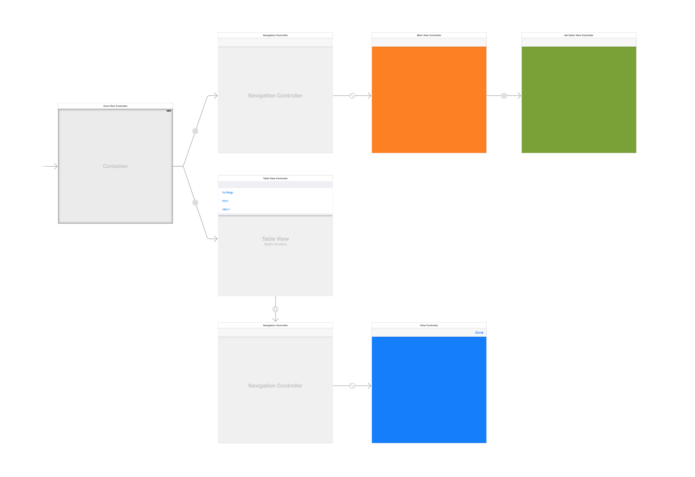
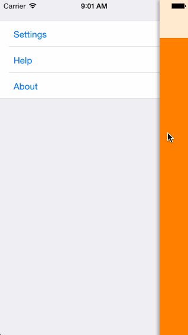

# Menu Sample App

Menu is a sample app that shows how to insert a menu in to `UINavigationController` backed application. The sample shows how to provide a exit action for modal views, as well as animation for hiding and showing the menu.

I’ve not written up a [blog](http://blog.paulj.me) post with this one as it started out as an experiment; however, if anyone would like me write it up then [let me know](http://twitter.com/pj_) and I will.

## Demo

